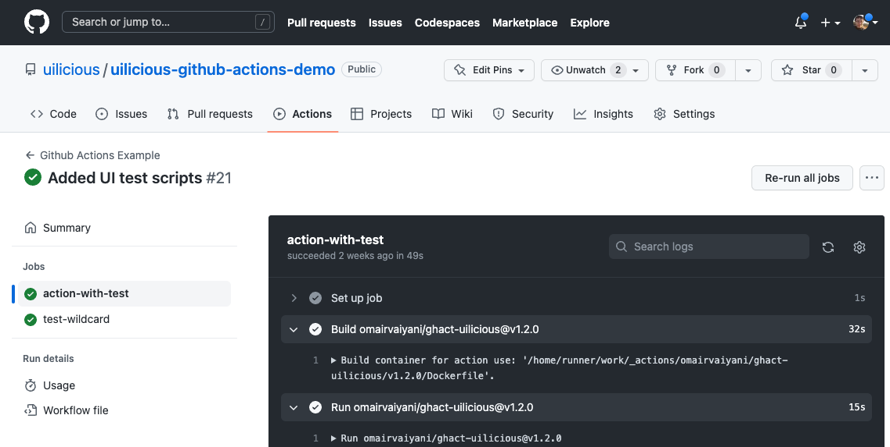
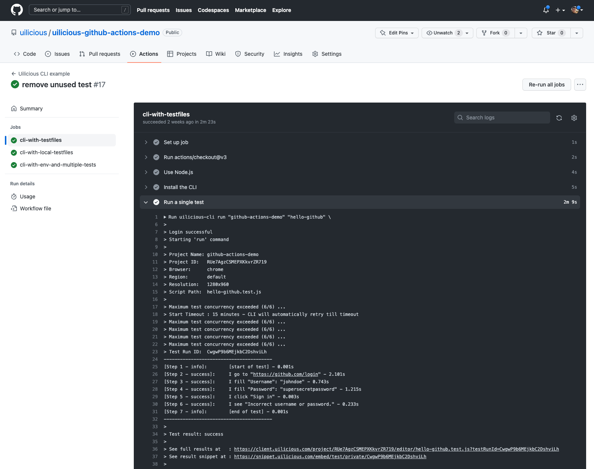
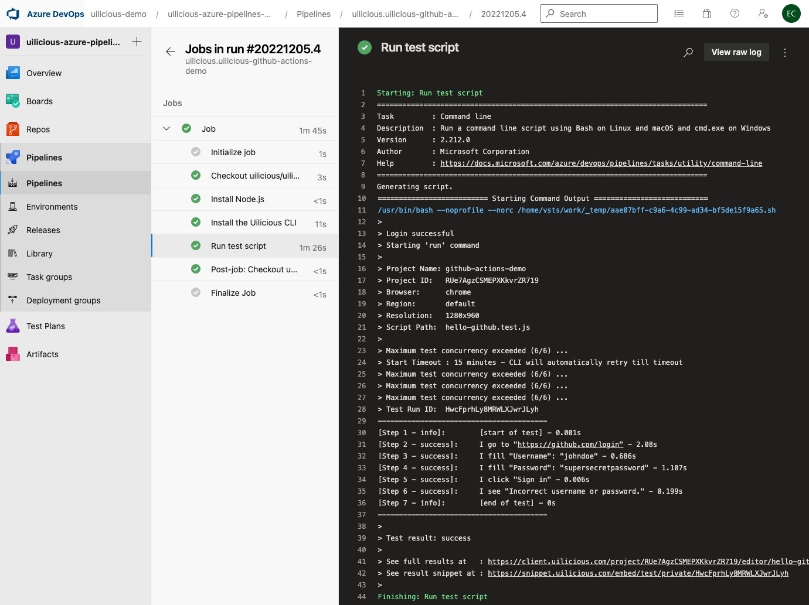

# uilicious-github-actions-demo
The following outlines the main ways to integrate the uilicious-cli with the github actions or azure.

The repo/docs for the CLI is here: https://github.com/uilicious/uilicious-cli

In all examples, you will need to setup the respective github actions / azure secrets

## Option 1) Use the community github actions

> Note, this is not written and maintained officially by the uilicious team

Repository (with more docs): https://github.com/omairvaiyani/ghact-uilicious

It includes various enhancments, to improve ease of setup and use.

Example script:
```.yml
name: Github Actions Example
on:
  push:
    branches:
      - main
  pull_request:
    branches:
      - main
jobs:
  # Run a single test file
  action-with-test:
    runs-on: ubuntu-latest
    steps:
      - uses: omairvaiyani/ghact-uilicious@v1.2.0
        with:
          access-key: ${{ secrets.UILICIOUS_ACCESSKEY }}
          project: github-actions-demo
          tests: hello-github
  # Run a multiple test file using a wildcard
  test-wildcard:
    runs-on: ubuntu-latest
    steps:
      - uses: omairvaiyani/ghact-uilicious@v1.2.0
        with:
          access-key: ${{ secrets.UILICIOUS_ACCESSKEY }}
          project: github-actions-demo
          tests: hello-*
          pattern: true
```

Giving an output like the following



## Option 2) Use the uilicious-cli via github actions

Alternatively, you can use the uilicious-cli directly

Example script:
```.yml
name: Uilicious CLI example
on:
  push:
    branches: [ main, master ]
  pull_request:
    branches: [ main, master ]
jobs:
  # Running a single test file
  cli-with-testfiles:
    runs-on: ubuntu-latest
    steps:
      # Repository checkout, node.js install, and cli install
      - uses: actions/checkout@v3
      - name: Use Node.js
        uses: actions/setup-node@v3
        with:
          node-version: '12.x'
      - name: Install the CLI
        run: npm install -g uilicious-cli
      # Actual cli run
      - name: Run a single test
        run: |
          uilicious-cli run "github-actions-demo" "hello-github" \
            --browser chrome \
            --key ${{ secrets.UILICIOUS_ACCESSKEY }}
  # Running using files local in your repository
  cli-with-local-testfiles:
    runs-on: ubuntu-latest
    steps:
      # Repository checkout, node.js install, and cli install
      - uses: actions/checkout@v3
      - name: Use Node.js
        uses: actions/setup-node@v3
        with:
          node-version: '12.x'
      - name: Install the CLI
        run: npm install -g uilicious-cli
      # Actual cli run
      - name: Run a single test
        run: |
          uilicious-cli run "github-actions-demo" "hello-github" \
            --browser chrome \
            --testCodeDir ./ui-test \
            --key ${{ secrets.UILICIOUS_ACCESSKEY }}
```

Giving an output like the following



## Option 3) Use the uilicious-cli with azure pipelines

Example script
```
# Branch trigger
trigger:
- main

# VM pool to use
pool:
  vmImage: ubuntu-latest

# CI steps
steps:
# Install the required CLI
- task: NodeTool@0
  inputs:
    versionSpec: '16.x'
  displayName: 'Install Node.js'
- script: |
    npm install -g uilicious-cli
  displayName: 'Install the Uilicious CLI'
# And run it
- script: |
    uilicious-cli run "github-actions-demo" "hello-github" \
      --browser chrome \
      --key $(UILICIOUS_ACCESSKEY)
  displayName: 'Run test script'
```

Giving an output like the following


